## Pie Charts

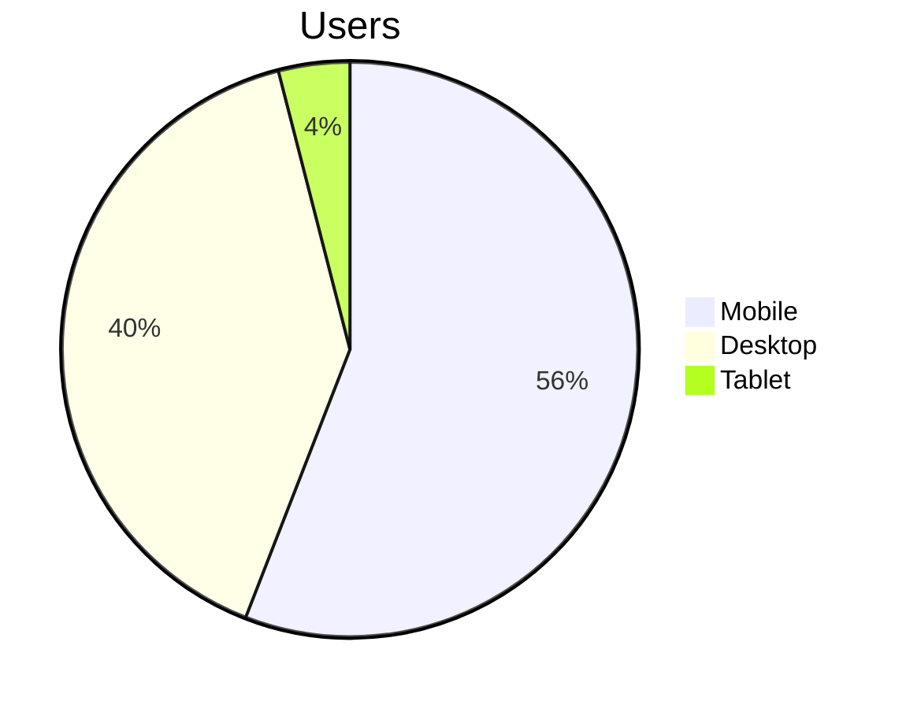

## Graphs

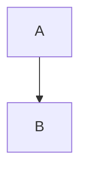

### Direction

1. Top to Bottom
	```mermaid
	graph TB
	A-->B
	```
2. Bottom to Top
	```mermaid
	graph BT
	A-->B
	```
3. Left to Right
	```mermaid
	graph LR
	A-->B
	```
4. Right to Left
	```mermaid
	graph RL
	A-->B
	```
	
### Shapes

1. Normal Box
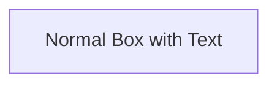

2. Pill Shaped Box
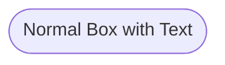
3. Box with Rounded edges
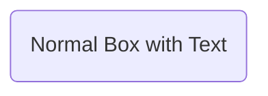
4. Subroutine shaped Box
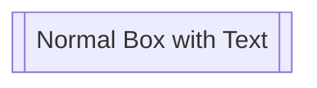
5. Cylindrical Shape
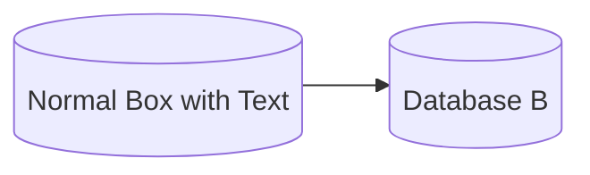
6. Circle
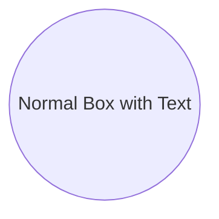
7. Asymmetric Shape
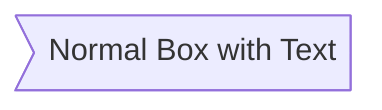
8. Rhombus
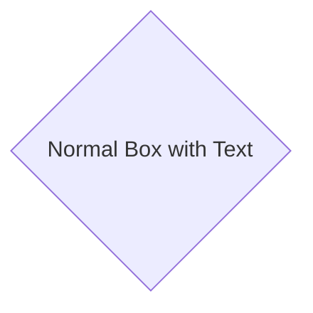
9. Hexagon
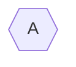
10. Parallelogram 
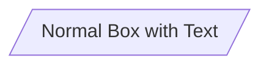
11. Parallelogram Alternative
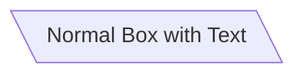
12. Trapezoid
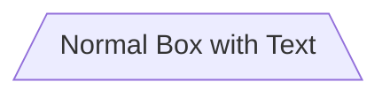
13. Trapezoid Alternative
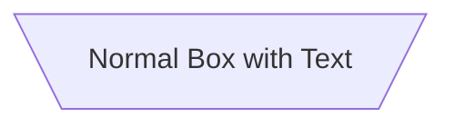

### Links

1. Arrow head

2. Open Link
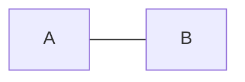
3. Text on Link
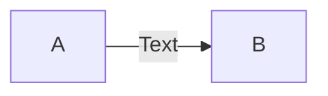
4. Dotted Link
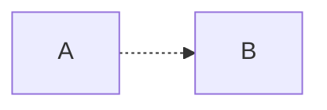
5. Dotted Link with Text
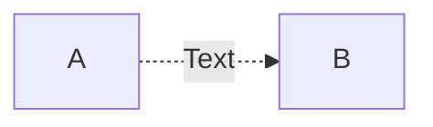
6. Thick Link
```mermaid
graph LR
A ==> B
```

## Gantt Charts

```mermaid
gantt
title Productivity Guru Videos
dateFormat DD-MM-YYYY
section Obsidian Basics
Markdown: a1, 04-07-2020, 3d
Diagrams: after a1, 07-07-2020, 2d
section OtherVideos
example Video: 01-07-2020, 5d
video2: 07-07-2020, 12d
```

## Sequence Diagrams
```mermaid
sequenceDiagram
Alice ->>John: Hello John, How are you ?
John -->>Alice: Great !
```

## Class Diagram

```mermaid
classDiagram
class Animal
Vehicle <|-- Car
```

## State Diagram
```mermaid
stateDiagram-v2
Push --> Move
Move --> Stop
```

```mermaid
stateDiagram-v2
[*] --> s1
s1 --> [*]
```

## Entity Relationship Diagram
```mermaid
erDiagram
CUSTOMER ||--O{ ORDER : places
First entity relationship  second entity; relationship label
One to zero or more
ORDER ||--|{ LINE-ITEM : contains
One to one or more line 
CUSTOMER }|..|{ DELIVERY-ADDRESS :uses
One or more customers uses one or more delivery addresses
```


## User Journey

```mermaid
journey
title My working day
section Go to work
	Make tea: 5: Me
	Go upstairs: 3: Me
	Do work: 1: Me, Cat
section Go Home
	Go downstairs: 5 : Me
	Sit down: 5: Me
```
